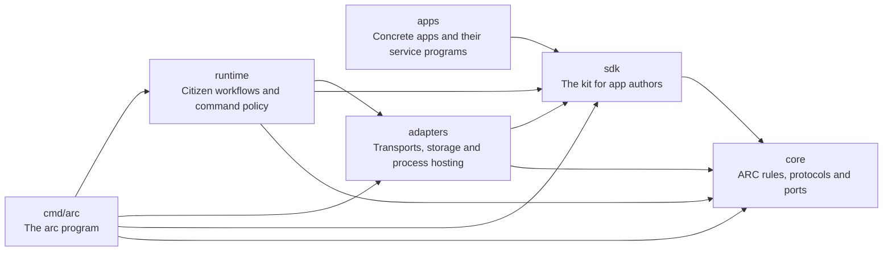

# ARC package boundaries

Core defines ARC's rules and ports. The SDK is the kit for app authors. Apps
use only the SDK, so an app can live in another repository. The arrows below
show source dependencies, not the order in which a message travels.

| Directory | Responsibility |
| --- | --- |
| `core/keys`, `core/private`, `core/draft` | Identity, signatures and encrypted event formats. |
| `core/store`, `core/node`, `core/mail` | Verified event retention, sync, durable mail, receipts and recovery. Storage is injected. |
| `core/call`, `core/wire` | Calls, replies, deadlines, cancellation and the provider line protocol. |
| `core/session` | Interaction modes, session identity/lifecycle, ordering, bounded credit, half-close, cancellation and final outcomes. |
| `core/transport` | Event transport ports: `Transport`, `Live`, `Carrier`, `Reconciler`. |
| `core/kv` | Atomic key-value persistence operations consumed by the durable mail state machine. |
| `core/compact`, `core/frame`, `core/relaylist` | Event encoding, bounded fragmentation and relay-list protocol. |
| `runtime/citizen`, `runtime/catalog`, `runtime/iface` | Citizen workflows, installs and consent, capability discovery and manifest-driven commands. |
| Other `runtime/` packages | App deployment/configuration models, lists, wake behavior and release/update workflows. |
| `apps/<name>/` | One complete app: manifest, Arcfile, service implementation in `server/`, and its program in `cmd/arc-<name>`. Data apps can consist of a manifest. |
| `cmd/arc` | The arc program. It imports no app. |
| `sdk/provider`, `sdk/stdio` | The provider runtime for an app, its session types, and process standard streams. |
| `sdk/httpadapter`, `sdk/execadapter`, `sdk/ndjson` | HTTP and process I/O mapped to ARC calls and sessions, and their record reader. |
| `sdk/providerconfig`, `sdk/strictjson`, `sdk/atomicfile`, `sdk/limitio` | Configuration files, strict JSON, atomic file writes and bounded buffers. |
| `sdk/providertest` | A real session for the tests of an app. |
| `adapters/transport/relay`, `adapters/transport/file` | Nostr relay and carried-directory event delivery. |
| `adapters/provider/host` | Subprocess hosting of a provider program. |
| `adapters/keyfile`, `adapters/nip05` | Identity files and network name resolution. |
| `adapters/search/bleve` | Bleve indexing, query parsing and local search files. |
| `adapters/store/bolt`, `adapters/kv/bolt`, `adapters/mailbox` | Bolt persistence and composition with core event/mail rules. |
| `adapters/relay/*` | Khatru integration for sealed-event access, groups and relay limits. |
| `internal/search` | Shared application search request/result types. No ARC protocol rules. |
| `internal/` | Small shared types, implementation utilities and test infrastructure. Core does not import these packages. |

## Dependency rules

Core production packages depend only on other core packages, the standard
library's non-I/O facilities, and event/cryptographic primitives. They do not
import runtime code, concrete adapters, filesystem/process/network APIs,
or database drivers. `io.Reader`, `io.Writer` and `io.Closer` are ports, so the
provider runtime can use them without selecting process streams itself.

The upstream Nostr module contains both protocol and network facilities. These
rules govern the APIs used by ARC production code; they do not claim that the
upstream module's entire transitive dependency graph is free of network code.

Runtime composition selects concrete adapters. `runtime/citizen.Open`
constructs a citizen's disk stores, mail store and relay adapters. An embedded
caller can construct core components with different implementations.

An app imports only `sdk/` and its own packages, so it can build in another
repository. The SDK imports only `core/` and `sdk/`. `cmd/arc` imports no app.
The runtime and adapters must not import concrete apps or executable entry
points, and an adapter must not import runtime workflows. An adapter implements
the interface of the layer that consumes it: ARC event adapters implement core
contracts, and application search implements the interface that `runtime/iface`
owns, with shared types from `internal/search`. An app can enforce its own
shell, SQL or HTTP policy outside core.

`internal/architecture` checks these rules from production imports, including
platform-specific files. It also checks the tests of each app: they must not
import an internal package. Other test imports are exempt, so integration tests
can use real relays, files and subprocesses. Run `mise run boundaries`; the same
check runs in `go test ./...` and CI.

`internal/specs` checks that each package under `core/` and `sdk/` belongs to a
spec. See [how to write a spec](SPEC-TEMPLATE.md).

## Apps, programs and services

ARC extends Unix command composition across authenticated identities and delivery
paths. An app owns a named interface and optional executable programs. A program
is code; an instance is a running program under an operating identity. A service
is the interface that instance exposes. A session is one bounded interaction.
Provider and consumer remain protocol roles, which one participant can hold at
the same time. Neither role is an app category.

The CLI uses app names for installed commands. `arc apps init`, `list`, `info`
and `remove` create service apps and manage command installs. `arc install`
records consent and installs a signed interface; it does not download a program
or start a service. `arc serve <app-directory>` reads its Arcfile and runs its
service program, directly or through the translator of its protocol. The
Arcfile also limits the callers and the calls of the program; see
[the Arcfile](../apps/README.md#the-arcfile). Local or remote execution follows the selected interface and
participant, not the app's name.

Journal defines local data commands in `apps/journal/manifest.json`. Shared
manifest primitives in `runtime/iface` implement their bounded behavior over
core events and storage. SQLite defines client commands in its manifest, and SQL
policy in `apps/sqlite/server`. `apps/sqlite/cmd/arc-sqlite` supplies process streams and
signals. No handwritten SQLite client binary is required.

Command stdout holds results; stderr holds diagnostics. Hosted service program
stdout carries the ARC stdio protocol. Live sessions retain flow control,
cancellation, half-close and final outcomes. Durable event delivery remains a
separate operation: a directory carrier need not support a live REPL.

See [the apps directory](../apps/README.md) for the layout and commands.

## Application search

Journal search is an application feature. `runtime/iface.SearchIndex` defines
its search effect, and `adapters/search/bleve` supplies Bleve Scorch indexing and
persistence. Notebook filtering, source selection and decryption remain in the
application workflow. Core has no search dependency or search interface.

The request and result types in `internal/search` let application consumers and
adapters share this contract without an adapter importing application code. Other
ARC applications can use the adapter when they have a concrete search need.
Reuse does not make search part of the ARC protocol.

## HTTP and live sessions

There are two different possible HTTP roles:

- `sdk/httpadapter` currently converts an ARC call into an HTTP application request.
- A future HTTP delivery adapter would move signed ARC events between nodes.

Both roles are outside core. The HTTP application adapter supports buffered calls,
streaming HTTP bodies, SSE, and WebSocket sessions through the shared core runtime.

Core now defines `request_reply`, `server_stream` and `duplex` interactions.
`core/session` implements ordering, bounded flow control, cancellation, half-close
and final outcomes. `core/call` carries authenticated session frames over any
`transport.Live` event adapter, and `sdk/provider` exposes the same machinery to
handlers and nested consumers. Relays and provider stdio use this protocol;
neither adapter implements session behavior. See [the session contract](sessions/SPEC.md).

A provider and a consumer are roles a participant can hold at the same time.
A provider that calls another provider uses the same core interaction contracts.
Application composition still selects paths and enforces installation consent.
`runtime/citizen.Session` is a local application context containing identity,
stores and configuration; it is not the core interaction/session state machine.

Session v1 is memory-only. A lost watch ends the session explicitly. Reconnecting
does not resume it or repeat its commands. The provider owns its REPL variables,
SQL transaction context and other application state.

Relay delivery already supports live event subscriptions. Directory delivery
supports carried events. Bluetooth remains planned. Adding a carrier must retain
core verification and the existing mail/call rules; see
[the transport contract](delivery/TRANSPORTS.md).

## Persistence

Disk adapters keep `events.db`, `mail.db`, key-file permissions and the existing
Bolt buckets of mail. A key-value update commits its whole callback or rolls it
all back. The event-store adapter holds its process lease through verification and
persistence. Core remains responsible for refusing invalid events and avoiding
re-execution after an uncertain outcome.
