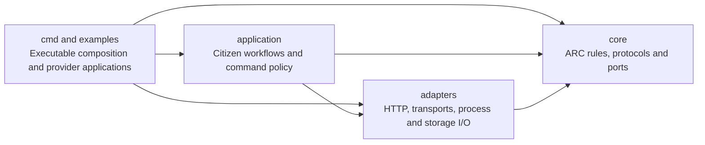

# ARC package boundaries

Core defines ARC's rules and ports. Concrete transports and application-protocol
adapters sit outside core. The arrows below show source dependencies, not the
order in which a message travels.

| Directory | Responsibility |
| --- | --- |
| `core/keys`, `core/private`, `core/draft` | Identity, signatures and encrypted event formats. |
| `core/store`, `core/node`, `core/mail` | Verified event retention, sync, durable mail, receipts and recovery. Storage is injected. |
| `core/call`, `core/provider`, `core/provider/wire` | Calls, replies, deadlines, cancellation and the shared provider runtime/protocol. Runtime I/O is supplied by its caller. |
| `core/session` | Interaction modes, session identity/lifecycle, ordering, bounded credit, half-close, cancellation and final outcomes. |
| `core/transport` | Event transport ports: `Transport`, `Live`, `Carrier`, `Reconciler`. |
| `core/journal` | Atomic persistence operations consumed by the durable mail state machine. |
| `core/compact`, `core/frame`, `core/relaylist` | Event encoding, bounded fragmentation and relay-list protocol. |
| `application/citizen`, `application/catalog`, `application/iface` | Citizen workflows, installs and consent, capability discovery and manifest-driven commands. |
| Other `application/` packages | Bundle/configuration models, lists, wake behavior and release/update workflows. |
| `adapters/http` | HTTP application requests mapped to ARC provider calls. |
| `adapters/transport/relay`, `adapters/transport/file` | Nostr relay and carried-directory event delivery. |
| `adapters/provider/host`, `adapters/provider/stdio` | Subprocess hosting and process standard streams. |
| `adapters/keyfile`, `adapters/nip05` | Identity files and network name resolution. |
| `adapters/store/bolt`, `adapters/journal/bolt`, `adapters/mailbox` | Bolt persistence and composition with core event/mail rules. |
| `adapters/relay/*` | Khatru integration for sealed-event access, groups and relay limits. |
| `adapters/providerconfig` | Provider configuration files and their validation helpers. |
| `internal/` | Small shared implementation utilities and test infrastructure. Core does not import these packages. |

## Dependency rules

Core production packages depend only on other core packages, the standard
library's non-I/O facilities, and event/cryptographic primitives. They do not
import application code, concrete adapters, filesystem/process/network APIs,
or database drivers. `io.Reader`, `io.Writer` and `io.Closer` are ports, so the
provider runtime can use them without selecting process streams itself.

The upstream Nostr module contains both protocol and network facilities. These
rules govern the APIs used by ARC production code; they do not claim that the
upstream module's entire transitive dependency graph is free of network code.

Application composition selects concrete adapters. `application/citizen.Open`
constructs a citizen's disk stores, mail journal and relay adapters. An embedded
caller can construct core components with different implementations. HTTP and
provider process adapters depend on the same core contracts as other providers.

An adapter must not import application workflows or executable packages. It
translates a concrete system's operations into a core contract. Concrete provider
applications can enforce their own shell, SQL or HTTP policies outside core.

`internal/architecture` checks these rules from production imports, including
platform-specific files. Test imports are exempt so integration tests can use
real relays, files and subprocesses. Run `mise run boundaries`; the same check is
included in `go test ./...` and CI. The existing runtime and CLI tests validate
behavior across the package boundaries.

## HTTP and live sessions

There are two different possible HTTP roles:

- `adapters/http` currently converts an ARC call into an HTTP application request.
- A future HTTP delivery adapter would move signed ARC events between nodes.

Both roles are outside core. The current HTTP adapter still returns one complete
reply. HTTP streaming and WebSocket application mappings are not implemented.

Core now defines `request_reply`, `server_stream` and `duplex` interactions.
`core/session` implements ordering, bounded flow control, cancellation, half-close
and final outcomes. `core/call` carries authenticated session frames over any
`transport.Live` event adapter, and `core/provider` exposes the same machinery to
handlers and nested consumers. Relays and provider stdio use this protocol;
neither adapter implements session behavior. See [the session contract](sessions/SPEC.md)
and the [REPL example](../examples/repl/README.md).

A provider and a consumer are roles a participant can hold at the same time.
A provider that calls another provider uses the same core interaction contracts.
Application composition still selects paths and enforces installation consent.
`application/citizen.Session` is a local application context containing identity,
stores and configuration; it is not the core interaction/session state machine.

Session v1 is memory-only. A lost watch ends the session explicitly. Reconnecting
does not resume it or repeat its commands. The provider owns its REPL variables,
SQL transaction context and other application state.

Relay delivery already supports live event subscriptions. Directory delivery
supports carried events. Bluetooth remains planned. Adding a carrier must retain
core verification and the existing mail/call rules; see
[the transport contract](delivery/TRANSPORTS.md).

## Go API migration

This refactor changes Go import paths. It does not add forwarding packages at
the old paths. External Go consumers must update their imports and constructors.
Existing CLI commands, request/reply event formats, provider messages and
persistent file names/buckets remain compatible. Live sessions add `arc session`,
an opt-in manifest declaration, a new private event kind and `session` provider
messages; these additions require a provider/runtime that supports sessions.

| Previous API | Current API |
| --- | --- |
| `delivery/{call,keys,mail,node,private,store,transport,...}` | Corresponding `core/` packages; concrete implementations move to `adapters/`. |
| `internal/citizen`, `iface`, `capability`, `bundle`, `lists`, `release`, `wake`, `delivery/catalog` | Corresponding `application/` packages. |
| `provider` | `core/provider` for contracts and runtime. |
| `provider.HTTP(handler)` | `httpadapter.New(handler)` from `adapters/http`. |
| `provider.Run` with default process streams | `stdio.Run` from `adapters/provider/stdio`, using `core/provider.Options`. |
| `provider.Run` with injected streams | `core/provider.Run`; input and output are required, and omitted logs are discarded. |
| `provider/host` | `adapters/provider/host`. |
| `provider.ConfigPath`, `ReadConfig`, `Grants`, `Limit`, `Directory` | `adapters/providerconfig`. |
| `store.Open(directory)` | `boltstore.Open(directory)` from `adapters/store/bolt`; core tests/embedders can use `store.New(backend)`. |
| `mail.Open(directory, ...)` | `mailbox.Open(directory, ...)` from `adapters/mailbox`; core embedders use `mail.New(journal, ...)`. |
| `keys.Save`, `Load`, `Read`, `Write` and key-file errors | `adapters/keyfile`. |
| `keys.ResolvePublic` | `adapters/nip05.ResolvePublic`; offline parsing remains `core/keys.ParsePublic`. |

Disk adapters keep `events.db`, `mail.db`, key-file permissions and the existing
journal buckets. A journal update commits its whole callback or rolls it all
back. The event-store adapter holds its process lease through verification and
persistence. Core remains responsible for refusing invalid events and avoiding
re-execution after an uncertain outcome.
