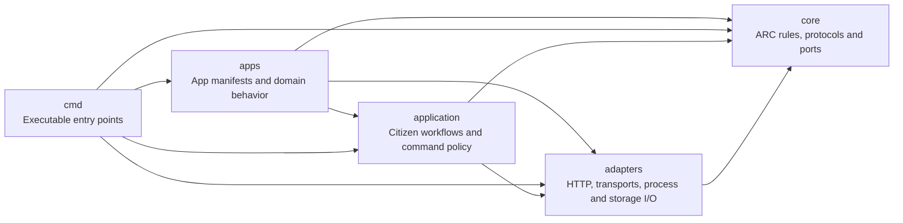

# ARC package boundaries

Core defines ARC's rules and ports. Concrete transports and application-protocol
adapters sit outside core. The arrows below show source dependencies, not the
order in which a message travels.

| Directory | Responsibility |
| --- | --- |
| `core/keys`, `core/private`, `core/draft` | Identity, signatures and encrypted event formats. |
| `core/store`, `core/node`, `core/mail` | Verified event retention, sync, durable mail, receipts and recovery. Storage is injected. |
| `core/call`, `core/provider`, `core/provider/wire` | Calls, replies, deadlines, cancellation and the shared provider runtime/protocol. Runtime I/O is supplied by its caller. |
| `core/session` | Interaction modes, session identity/lifecycle, ordering, bounded credit, half-close, cancellation and final outcomes. |
| `core/transport` | Event transport ports: `Transport`, `Live`, `Carrier`, `Reconciler`. |
| `core/journal` | Atomic persistence operations consumed by the durable mail state machine. |
| `core/compact`, `core/frame`, `core/relaylist` | Event encoding, bounded fragmentation and relay-list protocol. |
| `application/citizen`, `application/catalog`, `application/iface` | Citizen workflows, installs and consent, capability discovery and manifest-driven commands. |
| Other `application/` packages | App deployment/configuration models, lists, wake behavior and release/update workflows. |
| `apps/` | App manifests, domain behavior and reusable service implementations. Data apps can consist of a manifest. |
| `cmd/arc`, `cmd/arc-*` | CLI and thin service program entry points. |
| `adapters/http` | HTTP application requests mapped to ARC provider calls. |
| `adapters/transport/relay`, `adapters/transport/file` | Nostr relay and carried-directory event delivery. |
| `adapters/provider/host`, `adapters/provider/stdio` | Subprocess hosting and process standard streams. |
| `adapters/keyfile`, `adapters/nip05` | Identity files and network name resolution. |
| `adapters/search/bleve` | Bleve indexing, query parsing and local search files. |
| `adapters/store/bolt`, `adapters/journal/bolt`, `adapters/mailbox` | Bolt persistence and composition with core event/mail rules. |
| `adapters/relay/*` | Khatru integration for sealed-event access, groups and relay limits. |
| `adapters/providerconfig` | Provider configuration files and their validation helpers. |
| `internal/search` | Shared application search request/result types. No ARC protocol rules. |
| `internal/` | Small shared types, implementation utilities and test infrastructure. Core does not import these packages. |

## Dependency rules

Core production packages depend only on other core packages, the standard
library's non-I/O facilities, and event/cryptographic primitives. They do not
import application code, concrete adapters, filesystem/process/network APIs,
or database drivers. `io.Reader`, `io.Writer` and `io.Closer` are ports, so the
provider runtime can use them without selecting process streams itself.

The upstream Nostr module contains both protocol and network facilities. These
rules govern the APIs used by ARC production code; they do not claim that the
upstream module's entire transitive dependency graph is free of network code.

Application composition selects concrete adapters. `application/citizen.Open`
constructs a citizen's disk stores, mail journal and relay adapters. An embedded
caller can construct core components with different implementations. HTTP and
provider process adapters depend on the same core contracts as other providers.

Runtime libraries and adapters must not import concrete apps or executable entry
points. An adapter must not import application workflows. It implements the interface consumed by the relevant layer. ARC event adapters
implement core contracts. Application search implements the interface owned by
`application/iface`, using shared types from `internal/search`. Concrete app
service implementations can enforce their own shell, SQL or HTTP policies outside core.

`internal/architecture` checks these rules from production imports, including
platform-specific files. Test imports are exempt so integration tests can use
real relays, files and subprocesses. Run `mise run boundaries`; the same check is
included in `go test ./...` and CI. The existing runtime and CLI tests validate
behavior across the package boundaries.

## Apps, programs and services

ARC extends Unix command composition across authenticated identities and delivery
paths. An app owns a named interface and optional executable programs. A program
is code; an instance is a running program under an operating identity. A service
is the interface that instance exposes. A session is one bounded interaction.
Provider and consumer remain protocol roles, which one participant can hold at
the same time. Neither role is an app category.

The CLI uses app names for installed commands. `arc apps init`, `list`, `info`
and `remove` create service apps and manage command installs. `arc install`
records consent and installs a signed interface; it does not download a program
or start a service. `arc serve <app-directory>` reads its Arcfile and runs its
service program. Local or remote execution follows the selected interface and
participant, not the app's name.

Journal defines local data commands in `apps/journal/manifest.json`. Shared
manifest primitives in `application/iface` implement their bounded behavior over
core events and storage. SQLite defines client commands in its manifest, and SQL
policy in `apps/sqlite/server`. `cmd/arc-sqlite` supplies process streams and
signals. No handwritten SQLite client binary is required.

Command stdout holds results; stderr holds diagnostics. Hosted service program
stdout carries the ARC stdio protocol. Live sessions retain flow control,
cancellation, half-close and final outcomes. Durable event delivery remains a
separate operation: a directory carrier need not support a live REPL.

See [the apps directory](../apps/README.md) for the layout and commands.

## Application search

Journal search is an application feature. `application/iface.SearchIndex` defines
its search effect, and `adapters/search/bleve` supplies Bleve Scorch indexing and
persistence. Notebook filtering, source selection and decryption remain in the
application workflow. Core has no search dependency or search interface.

The request and result types in `internal/search` let application consumers and
adapters share this contract without an adapter importing application code. Other
ARC applications can use the adapter when they have a concrete search need.
Reuse does not make search part of the ARC protocol.

## HTTP and live sessions

There are two different possible HTTP roles:

- `adapters/http` currently converts an ARC call into an HTTP application request.
- A future HTTP delivery adapter would move signed ARC events between nodes.

Both roles are outside core. The HTTP application adapter supports buffered calls,
streaming HTTP bodies, SSE, and WebSocket sessions through the shared core runtime.

Core now defines `request_reply`, `server_stream` and `duplex` interactions.
`core/session` implements ordering, bounded flow control, cancellation, half-close
and final outcomes. `core/call` carries authenticated session frames over any
`transport.Live` event adapter, and `core/provider` exposes the same machinery to
handlers and nested consumers. Relays and provider stdio use this protocol;
neither adapter implements session behavior. See [the session contract](sessions/SPEC.md).

A provider and a consumer are roles a participant can hold at the same time.
A provider that calls another provider uses the same core interaction contracts.
Application composition still selects paths and enforces installation consent.
`application/citizen.Session` is a local application context containing identity,
stores and configuration; it is not the core interaction/session state machine.

Session v1 is memory-only. A lost watch ends the session explicitly. Reconnecting
does not resume it or repeat its commands. The provider owns its REPL variables,
SQL transaction context and other application state.

Relay delivery already supports live event subscriptions. Directory delivery
supports carried events. Bluetooth remains planned. Adding a carrier must retain
core verification and the existing mail/call rules; see
[the transport contract](delivery/TRANSPORTS.md).

## Go API migration

This refactor changes Go import paths. It does not add forwarding packages at
the old paths. External Go consumers must update their imports and constructors.
Request/reply event formats, provider messages and persistent file names/buckets
remain compatible. App management moves from `arc tool` to `arc apps`. Service
programs are named `arc-exec`, `arc-sqlite`, `arc-http` and `arc-releases`. App
assets move from `cmd/*-provider` and `manifests/` to `apps/<name>`; update source
paths and process launch configuration when adopting this checkout.
Live sessions add `arc session`,
an opt-in manifest declaration, a new private event kind and `session` provider
messages; these additions require a provider/runtime that supports sessions.

| Previous API | Current API |
| --- | --- |
| `delivery/{call,keys,mail,node,private,store,transport,...}` | Corresponding `core/` packages; concrete implementations move to `adapters/`. |
| `internal/citizen`, `iface`, `capability`, `bundle`, `lists`, `release`, `wake`, `delivery/catalog` | Corresponding `application/` packages. |
| `provider` | `core/provider` for contracts and runtime. |
| `provider.HTTP(handler)` | `httpadapter.New(handler)` from `adapters/http`. |
| `provider.Run` with default process streams | `stdio.Run` from `adapters/provider/stdio`, using `core/provider.Options`. |
| `provider.Run` with injected streams | `core/provider.Run`; input and output are required, and omitted logs are discarded. |
| `provider/host` | `adapters/provider/host`. |
| `provider.ConfigPath`, `ReadConfig`, `Grants`, `Limit`, `Directory` | `adapters/providerconfig`. |
| `store.Open(directory)` | `boltstore.Open(directory)` from `adapters/store/bolt`; core tests/embedders can use `store.New(backend)`. |
| `mail.Open(directory, ...)` | `mailbox.Open(directory, ...)` from `adapters/mailbox`; core embedders use `mail.New(journal, ...)`. |
| `keys.Save`, `Load`, `Read`, `Write` and key-file errors | `adapters/keyfile`. |
| `keys.ResolvePublic` | `adapters/nip05.ResolvePublic`; offline parsing remains `core/keys.ParsePublic`. |

Disk adapters keep `events.db`, `mail.db`, key-file permissions and the existing
journal buckets. A journal update commits its whole callback or rolls it all
back. The event-store adapter holds its process lease through verification and
persistence. Core remains responsible for refusing invalid events and avoiding
re-execution after an uncertain outcome.
