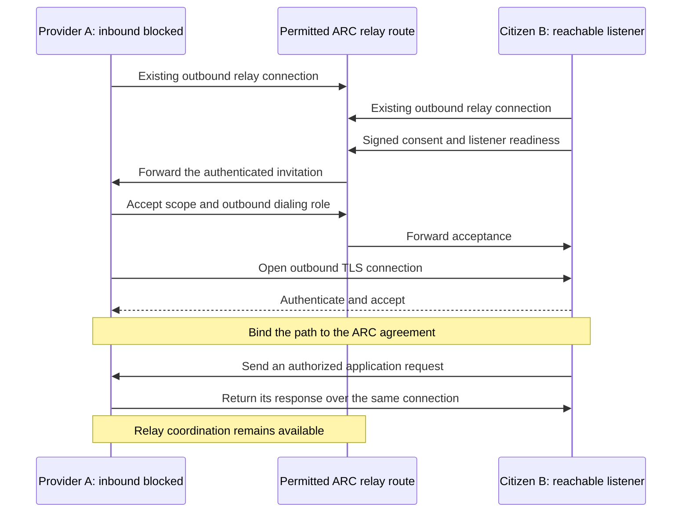

# Resilient path selection and reverse dialing

## Status and objective

This extends the [connection lifecycle](PROMOTION.md) and [OTP TLS
carrier](CARRIER.md). The first direct profile implements explicit reverse
dialing, nomination from local policy, and an optional best-effort TCP
hole-punch attempt. Broader pathfinding remains design work.
ARC should preserve an authorized working communication path while preparing
alternatives. Reliability takes priority over a shorter path or lower latency.

Connection direction and application roles are independent. A provider may dial
its caller, or a caller may dial its provider. After establishment, either side
can send over the connection. This follows TCP's bidirectional connection model;
see [TCP connection establishment](https://www.rfc-editor.org/rfc/rfc9293.html#section-3.5).
ARC still authenticates both citizens and checks the provider's resource grants.

## Example: only the caller accepts inbound connections

The firewalled endpoint receives the invitation through its existing outbound
relay connection. It does not need a new inbound connection to receive that
instruction. The invitation is a structured, peer-authenticated ARC control
message. A relay forwards it; it does not gain authority to make citizens connect
to arbitrary addresses or execute commands.

Listening must itself be allowed by the endpoint's owner policy. A caller that
accepts a provider's connection does not become a public application provider.
The connection admits only the agreed identity, resource, and route generation.
Receiving that connection does not grant access to other local tools.

## Candidate paths

Keep a bounded set of permitted candidates per peer and consent scope:

| Candidate | Dialer | Listener | Eligibility |
| --- | --- | --- | --- |
| Current relay route | Existing connections | Existing relays | Current sharing, transit, and service permissions remain valid. |
| Direct toward provider | Citizen | Provider | Provider allows listening; citizen allows dialing this candidate. |
| Direct toward citizen | Provider | Citizen | Citizen allows listening; provider allows dialing this candidate. |
| Hole-punch candidate | Either endpoint | Short-lived peer port reuse | Both exact rules enable `hole_punch`; each observed endpoint is in the other rule's `dial` list. |
| Fresh relay route | Citizen's selected relay | Approved federation partners | Fresh discovery establishes a permitted route to the provider. |

Candidates bind endpoint identities, transport address, listener owner, consent
scope, expiry, and transport-key proof. Dialing direction is part of the accepted
context. Announcing a listener does not prove reachability from the actual peer.

Reachability observations are local to a peer pair, address, and network context.
Keep successful and failed observations only for a bounded lifetime. Invalidate
them on network/address changes, listener restarts, or permission changes. Do not
broadcast a global `reachable` flag or treat an earlier success as permanent
authority to connect. Candidates stay in the private conversation, not catalogs.

## Selection procedure

- Preserve the current healthy route while preparing alternatives. Initial
  conversations and promotion agreements still start through relays.
- Exchange permitted listener candidates after scope consent. An endpoint with
  no acceptable listener can still volunteer to dial the peer's candidate.
- Try recently successful, still-permitted directions first. Do not hardcode the
  application caller as dialer or wait only for an unreachable provider.
- Use bounded, staggered attempts across eligible addresses and directions. Each
  attempt has one designated dialer and a fresh identifier. A stalled candidate
  must not consume the entire attempt budget while alternatives are available.
- Complete certificate and ARC path checks before considering a candidate ready.
- Nominate a successful candidate through the relay conversation. Both endpoints
  bind readiness to the same attempt and route generation. Settle old requests
  before switching, then close losing candidate connections.
- If no candidate succeeds, continue through relays. A failed optimization must
  not fail an otherwise working application call.

The bounded attempt strategy borrows from
[Happy Eyeballs](https://www.rfc-editor.org/rfc/rfc8305.html), which avoids letting
one failing address hold up other attempts. ARC's reverse-direction coordination
and consent are additional protocol work. Exact limits and delays remain wire
specification work; promotion cannot extend an application's original deadline.

The winning offer's initiator coordinates nomination; that role need not be the
dialer or provider. The receiver arms the selected path before acknowledging it;
the sender must receive the matching acknowledgement before dispatching work.
Once a generation is selected, late success from another attempt cannot replace
it. Missing acknowledgements abandon promotion within its preparation deadline.
Probing may use parallel connections; application requests are never raced.

Choose by permission and verified health first. Preserve a stable active path
unless a measured benefit justifies switching. Use recent failure history before
latency as a preference, with a cooldown to avoid oscillation. No universal
performance score is chosen by this design.

## Recovery responsibilities

Endpoints choose who dials and which agreed direct path to admit. Relays continue
discovering permitted federation routes. Ordinary citizens do not become
forwarding hops merely by being reachable.

| Failure | Required recovery |
| --- | --- |
| Direct attempt refused or times out | Try another permitted address/direction within the budget; keep the relay route. |
| Active direct path fails | Stop submitting on it; establish a usable relay route for new requests. Existing operations can have unknown outcomes. |
| Chosen federation path fails | Resolve a fresh permitted relay route; never transplant old reply permissions or silently replay an operation. An existing healthy direct connection can continue within its current lease. |
| Citizen's relay connection fails | Keep an existing healthy direct connection within its current lease. Reconnect with the configured key pin, then consider explicitly configured backup relays. Reauthenticate and rediscover. |
| Permission is withdrawn | Stop the affected path on local withdrawal or receipt; the planner cannot override that decision. |
| No authorized path is available | Report unavailable within the caller's deadline. No unlimited queue or implicit local fallback. |

Under the lifecycle's [relay-outage policy](PROMOTION.md#direct-continuity-during-a-relay-outage),
an existing healthy direct connection carries in-scope requests until its current
lease expires while relay recovery runs. It cannot renew itself or authorize a
replacement connection. Expiry stops direct sends and admission even if the
connection still works. Recovery cannot invent or extend consent; changing
routes does not renew service grants.

Reconnects use bounded backoff with jitter. The owner may configure alternate
relay addresses and pins; discovery must not silently enroll the citizen with
arbitrary relays. Switching relay connections requires fresh route and reply
authority. Provider announcements currently bind a single home relay, so a backup
connection alone cannot preserve publication visibility. Provider republishing
needs an explicit policy that retains its sharing scope. Simultaneous publication
at multiple home relays is outside this initial plan.

## Implemented first profile and remaining gaps

- [Transport](../../apps/arc_net/lib/arc/net/transport.ex) owns one pinned relay
  connection per identity and schedules bounded reconnect attempts after loss.
- [TransportManager](../../apps/arc_net/lib/arc/net/transport_manager.ex) pools that
  single transport by identity; it has no configured backup-relay set.
- Relay-backed work can be unavailable while that transport reconnects. The
  separate local mailbox path is not a remote-recovery mechanism.
- [Federation](../federation/SPEC.md) retries configured partner connections and
  selects discovered routes. Reply permissions remain bound to a route and
  connection; it does not transparently reroute in-flight conversations.
- The first direct profile implements literal-address listeners, reverse dialing,
  nomination, finite leases, and bounded direct request/reply admission. It does
  not choose a route from health or latency measurements; matching owner policy
  explicitly selects the available candidates.
- There is at most one configured listener candidate per endpoint and direction.
  Mutual `hole_punch` rules can add relay-observed, exact-address candidates with
  source-port reuse. Endpoint-dependent NATs, firewall policy, and OS socket
  support can still prevent a connection; no router mapping is configured.
  Address-history scoring and automatic route ranking remain future work.

The configured pinned relay reconnects automatically. Backup-relay selection
still needs explicit configuration and publication semantics; this document does
not introduce supported configuration keys.

## Required evidence

- Block inbound access at the provider while allowing outbound access. Let the
  citizen accept its connection and perform an authorized SQLite request.
  Repeat with the opposite dialing direction.
- Stall the first candidate while another direction succeeds. Observe bounded
  promotion delay and uninterrupted relay requests during probing.
- Let competing attempts succeed together. Only the acknowledged winner can
  dispatch work; delayed losers cannot change the active generation.
- Reject false listener claims, mismatched certificates, and expired invitations
  before application admission. No unsolicited listener is opened.
- Change an address or withdraw permission. Cached success cannot authorize
  another connection or override the new policy.
- Break the direct path just after a write commits. Recovery must not execute
  it again, even if a new relay route is immediately available.
- Exercise mutual source-port reuse across representative NAT and firewall
  types. A failed punch must keep the relay request path and must not replay a
  submitted application operation. Loopback alone is insufficient evidence.
- Disconnect and restore the selected relay, then exercise any explicitly
  configured backup. Verify pins, sharing scope, and fresh reply authority.
- Lose relay access while direct requests continue. Verify the original lease
  still expires, including while replies are pending, without automatic replay.
  Restore relay access before and after expiry to verify fresh renewal binding
  and rejection of attempts to revive an expired generation.
- Verify neither-side-reachable and all-paths-unavailable outcomes with bounded
  resources and no implicit local fallback.
