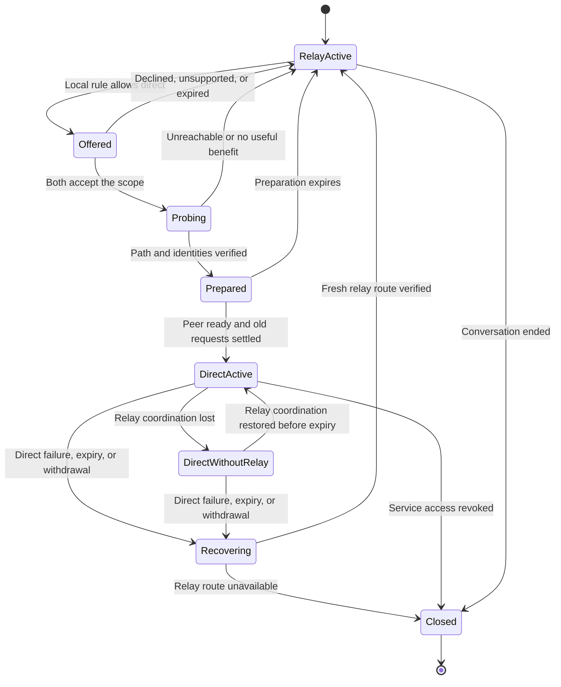

# Optional direct connection lifecycle

## Status and boundary

The first direct request/reply profile is implemented. It uses matching local
policy files, relay negotiation, literal listener candidates, mutually authenticated
TLS, independent ARC crypto contexts, finite leases, and relay-session renewal.
See [direct request/reply](DIRECT.md) for the supported configuration.

This document also retains the broader lifecycle design. Statements about path
ranking, multiple candidates, byte streams, and richer recovery remain future
work unless [DIRECT.md](DIRECT.md) says otherwise. `hole_punch` is a limited
best-effort TCP source-port reuse attempt, not general NAT traversal.

ARC starts remote conversations through relays. Once the endpoints agree, a
verified direct path may carry application traffic. Discovery and ongoing
coordination remain on the relay network. The citizen identity, provider identity,
and resource address remain the same:

```text
sqlite+arc://<provider-public-key>/main
```

This supersedes the earlier whitepaper proposal to remove `+arc` to request
promotion. The scheme describes the application protocol; connection policy
chooses the route. Direct operation still uses ARC authentication, framing, and
access checks. It does not expose the provider's raw database or bypass its handler.

## Policy and consent

| Proposed policy | Behavior |
| --- | --- |
| Relay only | Default. No direct candidate gathering, disclosure, or probing. |
| Allow direct | Negotiate over relays; use direct only with the peer's consent. |
| Local | Explicit same-host operation, outside this promotion lifecycle. |

The effective permission is the intersection of both endpoints' policies.
Advertising a capability, sharing it across federation, or knowing an address
does not grant direct permission. An unsupported or silent peer stays on relays.
Declining direct access does not revoke an otherwise valid service grant.

A human can approve a scoped rule; an agent can use a rule authorized by its
owner. Neither needs to be prompted for every request. There is no implicit
network-wide consent. Saved rules must explicitly state their scope and expiry;
the first implementation must not save permission merely because a probe worked.

An offer and its acceptance bind the following context:

- Both full citizen public keys and the current authenticated relay conversation.
- A fresh attempt identifier, protocol version, and route generation. A route
  generation distinguishes one path agreement from an earlier agreement.
- The provider capability ID, signed capability digest, exact resource path,
  and request/reply profile. Initial consent has no wildcard resource scope.
- The allowed address disclosure, direct transport profile, and finite lifetime.

Both parties accept this context before sharing candidates or contacting an
external address-discovery service. Consent includes exposing the selected
network address to the peer; using such a service also exposes an address to that
service. Local network candidates need separate permission. Candidates and
negotiation material stay in encrypted endpoint messages, never public catalogs.
Changing the peer, resource, capability digest, or allowed disclosure requires a
new agreement. Existing provider grants remain authoritative for every request.

When both exact rules enable `hole_punch`, relay-observed source IP addresses and
ports may be exchanged after that consent. Each observed address must still be in
the other owner's literal `dial` allowlist. The short-lived TCP attempts reuse a
source port with fixed TLS client and server roles. They do not configure routers
or expose a general application listener. Failure leaves traffic on relays and
never causes an application request to be replayed.

## Lifecycle

[Path selection](PATHS.md) determines which permitted endpoint listens and which
dials. Either citizen can open the connection regardless of application roles.
Keep the working route while checking alternatives and choose reliability before
latency. The implemented profile has no automatic alternative ranking. The
selected [carrier](CARRIER.md) is TLS over TCP.



Closing the conversation or revoking service access is also valid from every
intermediate state. The diagram omits those repeated arrows for readability.

| State | Required behavior |
| --- | --- |
| Relay active | Resolve the full provider key through the allowed relay route, verify its signed capability, and exchange authenticated application requests through relays. |
| Offered | Send an encrypted offer through that conversation. Keep application traffic on relays. No peer address or probe is needed to accept or reject an offer. |
| Probing | After mutual acceptance, exchange bounded candidates over relays. Perform paced reachability checks, then authenticate the actual direct connection as the agreed peer. Never send application bodies as probes. |
| Prepared | Bind the direct channel's handshake to the accepted context and selected candidate pair. Arm the receiver, then report readiness over relays. Finish outstanding requests on their original path. |
| Direct active | Submit new requests on the agreed direct channel only after receiving peer readiness. Continue relay coordination and refresh permission through the relay conversation. |
| Direct without relay | Keep the existing authenticated direct connection usable within its approved scope and unexpired lease. Recover relay coordination in the background. Do not extend the lease or establish a replacement direct connection without relays. |
| Recovering | Stop direct application sends. Resolve outstanding outcomes without replaying requests, retire the failed path, and establish a usable relay route before admitting new work. |
| Closed | Reject new work, close the direct connection, release attempt state, and destroy ephemeral secrets. A later connection starts through relays again. |

There is at most one active attempt per consent scope. Concurrent offers use a
deterministic ordering of initiator public key and attempt ID; both endpoints
retain the same winning offer. Losing and expired attempts cannot become active
through late accepts or readiness messages. Handlers must tolerate duplicate
control messages without opening duplicate connections or renewing expired state.

Preparation uses a bounded pause in admission to let existing requests finish;
it does not wait indefinitely. A receiver is ready before announcing readiness.
A sender switches only after its own preparation and the peer's readiness for
the same generation. A lost readiness message keeps that sender on relays. There
is no assumption that the endpoints change state at the same instant.

If existing requests do not settle before the preparation deadline, the endpoint
abandons the attempt, resumes relay admission, and leaves those requests subject
to their original deadlines and outcome rules. It must not enter direct active.
An endpoint abandoning an already announced readiness sends a cancellation when
possible and retires its direct generation. A peer that already started direct
work then follows the same failure rules; readiness is not a delivery guarantee.

Promotion is optional and must not extend an application's existing deadline.
Short requests may finish entirely through relays while a longer-lived client
negotiates. Readiness also requires evidence of a benefit appropriate to the
workload, such as lower round-trip latency. A reachable path is not automatically
faster. This is future policy: the implemented first profile uses explicit
matching policy and makes no performance-based switch decision.

## Identity, ordering, and admission

Reachability proves neither citizen identity nor provider authorization. The
direct handshake must authenticate both agreed ARC keys and bind the handshake
transcript to the relay-negotiated context. A successful socket connection or a
candidate's IP address is insufficient. A mismatched identity aborts the attempt.
The direct transport provides encryption and integrity without weakening the
existing ARC packet guarantees. Its TLS handshake pins the agreed ephemeral
certificates and binds ARC hello and finish proofs to a TLS exporter value and
the accepted direct context. The wider stream and resumption wire design remains
future work; this document does not invent that protocol.

The implemented first profile separates relay coordination from application data
into explicitly admitted cryptographic contexts. Each route generation has
independent send/replay state, with fresh data context on promotion or fallback.
Session lookup must support those simultaneous contexts without replacing another
context or resetting its counter. A single owner serializes each context's sends.
Late packets cannot recreate retired contexts just because their signature is
valid. Context creation, replay state, and tombstones need strict resource bounds.
Existing unpromoted sessions keep their current behavior.

[The direct manager](../../direct/manager.go) tracks direct request and reply
routes by peer, request ID, and route generation. [The client](../../client/peers.go)
waits for the matching generation, so a relay reply cannot satisfy a direct
request and a retired direct generation cannot dispatch a late frame.

Every application frame on a direct route is admitted through a cryptographic
context unique to that generation. The receiver checks the admitted connection
and generation before dispatch. A valid ARC signature alone cannot admit a packet
from an old or withdrawn direct connection. Relay packet headers remain unchanged;
the direct generation is tracked by the direct route context.

Each application request and its response use one route generation. Pending
requests settle before a voluntary switch; the switch never retransmits them.
The provider checks the caller and resource grant through the same handler on
both paths. Accepting direct permission cannot widen those grants. Internal
control messages must be intercepted by ARC and cannot reach the provider runtime
as SQL or other application input.

The first profile does not migrate an open byte stream. A future Git stream must
define acknowledged offsets, bounded replay of transport bytes, and duplicate
suppression separately. Application execution must never be repeated simply
because the carrier reconnects.

## Renewal, withdrawal, and failure

Permission is a renewable, finite lease for this conversation. Renew it through
an authenticated relay exchange bound to the same scope and direct generation;
one-way keepalives do not renew it. Lease deadlines use local monotonic clocks
with a negotiated maximum duration, not a peer's unbounded wall-clock expiry.
Network address changes require new candidate validation and a fresh agreement;
they do not silently inherit an old path's permission.

Either endpoint can withdraw direct permission immediately in its local state.
It closes direct admission and sends an authenticated withdrawal over every
working agreed path. It stops sending application traffic on the withdrawn path,
including pending replies. The peer stops on receipt or lease expiry; lost
messages cannot make remote withdrawal instantaneous. Withdrawal cannot erase
an address already disclosed, undo committed work, or recall bytes already sent.
A submitted request never moves to another path. If withdrawal prevents delivery
of its original-path reply, the caller reports an unknown outcome when it learns
of the failure or reaches its deadline.

### Direct continuity during a relay outage

If relay coordination becomes unavailable, a healthy, already authenticated
direct connection remains usable until its existing permission expires. This
includes new requests within the approved scope, subject to current provider
grants and each request's deadline. Relay recovery runs in the background with
bounded backoff; a failed recovery attempt alone does not close the healthy
direct connection. Each endpoint enforces its own negotiated lease deadline.

An outage, keepalive, or successful application request cannot extend that
deadline. A direct link alone cannot renew consent, disclose new candidates,
widen the agreement, or authorize a replacement connection. Direct failure,
address or identity change, process restart, withdrawal, or expiry ends this
continuation. Reconnecting with an old lease is not permitted. Service-grant
revocation closes the service conversation; revoking only direct permission
permits future relay requests if their grants still allow.

At expiry, stop direct application sends and admission, including dispatch of
newly received requests and transmission of pending replies, then retire the
generation. Already submitted operations may have unknown outcomes; expiry
does not undo their effects or permit replay. If the direct connection fails or
expires while no relay route is usable, report unavailable for new work within
its deadline. Do not silently fall back to a local mailbox.

Restoring relay access before expiry keeps the same healthy direct connection
and existing deadline. Renewal still requires a fresh authenticated exchange
through an authorized relay conversation. If recovery needs a new relay
conversation, both peers must explicitly bind it to the same still-live direct
generation and unchanged consent scope before renewing. Fresh route authority
and capability verification are required; reconnecting a relay socket is not a
renewal. A changed capability digest requires a new agreement.

After the direct generation is retired, restoring relay access cannot revive
it. A new offer needs an active applicable owner rule and a fresh mutual
agreement with a new generation. An owner's explicit withdrawal overrides a
saved allow rule for that scope until the owner changes it. Expired leases and
delayed renewals cannot restore a retired generation.

| Event | Application outcome |
| --- | --- |
| Offer declined, incompatible peer, or failed probe | Existing and new requests continue on relays. |
| Direct connection fails before any application submission | New work may use a newly verified relay route within the existing deadline. |
| Failure after submission, without a definitive reply | Report an unknown outcome. Never resend the operation automatically, including nominally read-only requests. |
| Local output fails after a successful reply | The operation already completed; changing paths does not undo it. |
| Lease expires or direct permission is withdrawn | Stop direct sends; outstanding operations may have unknown outcomes. Fresh relay requests remain subject to grants. |
| Relay coordination or federation route is unavailable, with a healthy approved direct connection | Continue direct requests within the existing scope and lease while restoring relay access. No renewal through direct traffic alone. |
| Relay coordination is unavailable and no usable approved direct connection remains | Pause new work during bounded recovery, then report unavailable within its deadline if recovery fails. No implicit local fallback. |

Closing a path does not prove that a provider canceled its work. A caller with an
unknown outcome must reconcile it with the application before issuing dependent
or repeated operations. Request correlation alone is not exactly-once execution.

## Federation and privacy

Offers and renewals follow the same allowed relay routes as ordinary calls.
They do not widen publication scope or intermediate operators' transit consent.
Current [federation reply permissions](../federation/SPEC.md#routed-delivery-and-private-replies)
are bound to the original route, local connection, and session, and expire after
180 seconds of inactivity. Direct traffic does not refresh those permissions.
Fallback must re-resolve the provider, verify its current capability and allowed
route, and establish a fresh relay conversation for new work. An old reply cannot
be redirected through a new route using an earlier permission.

Direct promotion does not give relays control of a connection they no longer
carry. They can block coordination and lease renewal; compliant endpoints stop
as above. Endpoints that deliberately ignore ARC policy can communicate outside
ARC. Provider-side grants remain the enforcement point for service access.

Relay operators can still see routing metadata and timing. Direct peers learn
each other's selected addresses. The provider and its machine operator retain
the same access to plaintext as before. Promotion adds neither anonymity nor
confidential execution on an untrusted host.

## Carrier work still required

[The carrier decision](CARRIER.md) selects TLS over TCP for the first
implementation, with ARC relay negotiation and explicit reachable listeners.
Neither-side-reachable cases remain on relays. Release packaging and identity
binding still need the documented adoption checks. The carrier must
bound frame size, queued bytes, concurrent handshakes, and resource use per peer
and globally. If its underlying network can reorder packets, it must restore
order before ARC's current replay guard. Never weaken the guard to make a test pass.

The initial carrier does not perform automatic traversal or router configuration.
If a later carrier adds traversal, use an established mechanism rather than
treating an exchanged address as proof of reachability.
[ICE](https://www.rfc-editor.org/rfc/rfc8445.html) defines UDP candidate checks;
ARC would carry its signaling. An ICE relayed candidate remains relayed.
[Consent freshness](https://www.rfc-editor.org/rfc/rfc7675.html) describes expiring
network permission for such a carrier, distinct from ARC owner approval and
provider grants. A carrier adopting it must follow its timers and checks alongside
ARC's relay lease. Neither protocol is part of the selected initial TCP carrier.

The carrier design must settle exact message encoding, handshake binding, and
numeric limits for attempts, candidates, leases, and cooldowns. Candidate handling
must prevent unbounded scanning or amplification: reject disallowed destinations,
pin validated addresses, pace checks, and require proof at the destination before
application traffic. Loopback, multicast, metadata endpoints, and unrelated local
services are never implicit probe targets. No new dependency or configuration key
is installed or enabled by these design documents.

## Required acceptance evidence

These are future implementation requirements, not tests already passing:

- Relay-only and local policy produce no direct discovery, probes, or listeners.
  Either endpoint's denial wins; legacy peers remain usable through relays.
- Permission for one identity, capability, or path cannot be reused for another.
  Changed capability digests require new consent; revoked grants block requests.
- Forged candidates, expired offers, crossed offers, and stale readiness messages
  cannot activate a path. No application body is sent before authentication.
- Delayed relay packets cannot be displaced by newer direct control or data.
  Independent contexts preserve counters and reject retired-generation packets.
- Losing a ready message is safe. No cutover stalls admission indefinitely, and
  no single request is sent on both paths.
- A write committed just before direct failure executes once and reports an
  unknown outcome if its reply is lost. Fallback does not execute it again.
- Expired federation permissions and changed routes require a fresh authorized
  relay conversation. Transit revocation prevents renewal rather than being bypassed.
- Relay loss preserves an existing healthy direct connection, including new
  in-scope requests, only until the unchanged lease deadline. Application traffic
  and direct keepalives cannot renew it or authorize a replacement connection.
- Relay recovery before expiry preserves the live direct generation; renewal
  requires fresh relay authorization and explicit binding if the conversation
  changed. Recovery after expiry and delayed renewals cannot revive a generation.
- Expiry, address change, withdrawal, and process restart stop direct admission
  within documented bounds. Expiry also stops pending replies; restart never
  restores a live direct lease. Direct failure during a relay outage reports
  unavailable or unknown outcomes without replay.
- Resource saturation rejects excess work without unbounded state or probes.
  Logs omit private candidates, credentials, application bodies, and secrets.
- Separate-process tests demonstrate actual path selection, payload fidelity,
  explicit failure outcomes, and measured benefit before claiming faster delivery.
