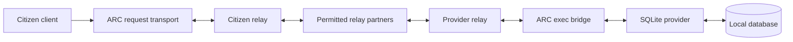

# Protocol transport over ARC

## Scope

ARC carries application bodies between citizen and provider identities. Relay
operators route the encrypted messages; the provider implements the application
protocol. The first general-purpose client is `arc request`, using the existing
request/reply frame format. SQLite is the first real database provider using it.

Implemented:

- Identity-addressed `<scheme>+arc://<full-provider-public-key>/<resource>` requests.
- Signed capability lookup and provider-key verification before application calls.
- Relay delivery, including permitted onward federation, with explicit local mode.
- Opaque request/reply bytes, including a binary-safe opt-in for external runtimes.
- A real SQLite provider with named databases and citizen access grants.

This is a bounded request/reply profile. It does not implement an arbitrary TCP
tunnel, Git remote helper, browser proxy, or a reliable continuous byte stream.



## Address and capability

```text
sqlite+arc://<64-hex-provider-public-key>/main
```

The URI scheme appends `+arc` to the advertised application protocol: a capability
with scheme `sqlite` is addressed using `sqlite+arc://`. The authority is the
complete provider key, never an IP address. The path names
a provider-defined resource. It does not grant filesystem access.

The initial parser accepts lowercase protocol names made of letters, digits, and
hyphens; hexadecimal provider keys; and paths containing ASCII letters, digits,
`/`, `.`, `_`, `~`, or `-`. It rejects user information, ports, queries, fragments,
percent escapes, dot segments, and the reserved `/info` control namespace. Names
and key prefixes are not supported by this client. This makes the trust target
explicit while leaving richer addressing for a future version.

The client fetches `GET /info/capabilities/primary` over the same ARC route. Use
`--capability ID` to select another capability. The signed package must verify,
its provider key must equal the address key, its capability ID must equal the
selection, and its scheme must match the URI. Only `request_reply` capabilities
are accepted. ARC takes the method from that package and the resource path from
the URI. It does not interpret the body or execute provider-authored client code.

The standard manifest `invocation` shape already describes request and response
bodies. A protocol provider can use a normal text body or opt into binary bytes:

```json
{
  "mode": "request_reply",
  "method": "RAW",
  "path": "/",
  "request_body": {"type": "bytes", "encoding": "base64"},
  "response_body": {"type": "bytes", "encoding": "base64"}
}
```

## Client usage

From the repository root, with an active citizen key:

```sh
mise run arc -- request 'sqlite+arc://<provider-public-key>/main' \
  --body '{"sql":"SELECT name FROM sqlite_schema WHERE type = ?","params":["table"]}' \
  --relay 127.0.0.1:7331 --relay-pubkey '<relay-public-key>'
```

`ARC_RELAY` and `ARC_RELAY_PUBKEY` also configure the relay. This new command
requires a relay and its pinned key unless `--local` is explicitly supplied.
An invalid or unavailable configured relay is an error, with no local fallback.
`--local` deliberately ignores relay environment variables and cannot be combined
with relay flags. Local peers use the existing same-host registry/mailbox path.

`--body TEXT` sends UTF-8 text. `--input PATH` reads bytes from a file; `--input -`
reads bytes from standard input. Exactly one input option is required. The
default output is the response body on standard output, with no added newline.
`--output PATH` writes a new file and refuses to overwrite an existing one.
Output failures after a completed request do not undo provider changes.

The Elixir API is `Arc.Data.Protocol.request(agent, uri, body, opts)`. The caller
owns the citizen agent and its delivery policy. Success returns
`{:ok, %{body: binary, meta: map}}`. The API consumes only replies matching both
the provider key and the generated request ID; unrelated inbox messages remain.

## Binary boundary

ARC frame bodies already carry raw bytes. Base64 is used only across the local
newline-delimited JSON connection to an external provider runtime. It is not an
extra network encoding layer or a change to the relay protocol.

With request encoding `base64`, the runtime receives:

```json
{"op":"request","request_id":"...","from":"<caller-key>","meta":{"method":"RAW","path":"/"},"encoding":"base64","message":"AP+A"}
```

With response encoding `base64`, it must reply:

```json
{"op":"reply","request_id":"...","encoding":"base64","reply":"AP+A"}
```

The bridge decodes the response before placing its bytes into an ARC frame.
Missing IDs, wrong encoding, invalid base64, and oversized decoded bodies fail
explicitly. Text providers retain the existing JSON contract. Non-UTF-8 input to
a text provider is rejected by the URI client before application submission.

## Limits and failure semantics

- URI client request and response bodies: at most 1 MiB each. Signed detail
  documents fetched by that client: 256 KiB. These limits do not replace the
  larger legacy exec text contract used by other clients.
- Providers can declare `invocation.request_body.max_bytes`, which the exec bridge
  enforces even when a caller bypasses the URI client. SQLite declares 1 MiB and
  applies its own lower configured query-body limit. Legacy text runtimes default
  to 64 MiB; binary runtimes have a 1 MiB ceiling.
- Each exec provider admits at most 256 pending requests. Duplicate pending IDs,
  a full queue, and a busy runtime pipe fail before forwarding. Pending slots are
  released by replies or process exit, not client timeouts. A stuck runtime can
  require an operator restart; freeing slots while its work remains queued would
  let callers accumulate unbounded work.
- Reply budget: 10 seconds by default, configurable with `--timeout` from 1 to
  120000 milliseconds. Discovery and application replies share this budget after
  peer connection. Existing relay connection/lookup timeouts also apply.
- Smaller relay frame caps can reject messages including their framing overhead.
- A request is sent once. There is no automatic retry, offline queue, reconnect
  recovery, or exactly-once execution guarantee.
- A timeout after application submission returns `outcome_unknown`. A provider
  may have committed a write before its response was lost. Check its state
  before submitting that operation again. Other connection failures can also
  leave uncertain effects; an error alone is not proof of rollback.
- Relays see identities and routing metadata. A normal provider sees the request
  and its data. Transport encryption does not hide data from that provider's host.

## Next profile: continuous byte streams

Git and other stream protocols should build on a common authenticated stream
profile. Before exposing a native client bridge, it needs an explicit opening
acknowledgement, provider-key and capability binding, ordered byte offsets, and
bounded flow control. The receiver grants a byte budget so a fast sender cannot
grow its buffers indefinitely. Closing one direction must preserve the other
direction until its remaining bytes are read. Reset/disconnect must surface an
error to the native client, rather than silently losing data.

Those stream semantics must be verified over multiple relay hops and under
disconnects. They are not supplied by naming a URI or by the current terminal
stream events. A later Git helper can connect Git's standard input/output to
that profile, while the provider maps the citizen identity to repository grants.
Relays should remain unaware of repository and database operations.

## Optional direct promotion

[Direct request/reply](DIRECT.md) is an implemented, explicit opt-in profile.
Both `arc serve` and `arc request` need matching `--direct-policy` files and
configured pinned relays. Relay delivery remains the default, and `--local` remains a
separate explicit mode. The identity-addressed URI and signed capability checks
do not change when a route promotes to direct TLS.

The profile has one reachable listener, literal operator-approved addresses,
finite leases, and relay-negotiated renewal. It has no automatic route ranking,
NAT traversal, backup relay configuration, stream migration, or application
replay. [Promotion](PROMOTION.md), [path selection](PATHS.md), and
[the carrier](CARRIER.md) describe the implemented boundary and future scope.

## Validation

```sh
mise exec -- mix test apps/arc_data/test/arc/data/protocol_test.exs \
  apps/arc_data/test/arc/data/binary_provider_test.exs \
  apps/arc_data/test/arc/data/handler/exec_test.exs \
  apps/arc_cli/test/arc/cli_protocol_test.exs
```

See [SQLite provider](../../go/cmd/sqlite-provider/README.md) for its independent tests
and [federation](../federation/SPEC.md) for operator routing policy.
